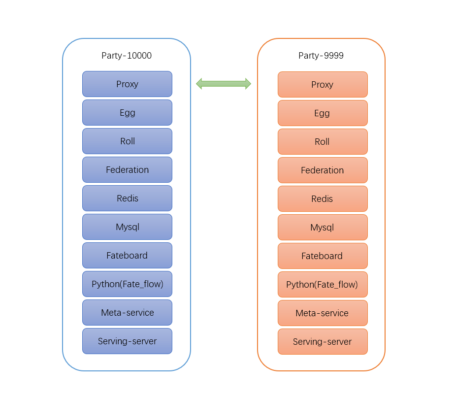

## 使用Docker Compose 部署 FATE

### 前言

[FATE](https://www.fedai.org/ )是一个联邦学习框架，能有效帮助多个机构在满足用户隐私保护、数据安全和政府法规的要求下，进行数据使用和建模。项目地址：（https://github.com/FederatedAI/FATE/） 本文档介绍使用Docker Compose部署FATE集群的方法。

### Docker Compose 简介

Compose是用于定义和运行多容器Docker应用程序的工具。通过Compose，您可以使用YAML文件来配置应用程序的服务。然后，使用一个命令，就可以从配置中创建并启动所有服务。要了解有关Compose的所有功能的更多信息，请参阅[相关文档](https://docs.docker.com/compose/#features)。

使用Docker compose 可以方便的部署FATE，下面是使用步骤。

### 目标

两个可以互通的FATE实例，每个实例均包括FATE所有组件。



### 准备工作

1. 两个主机（物理机或者虚拟机，都是Centos7系统）；
2. 所有主机安装Docker 版本 : 18+；
3. 所有主机安装Docker-Compose 版本: 1.24+；
4. 部署机可以联网，所以主机相互之间可以网络互通；
5. 运行机已经下载FATE 的各组件镜像（离线构建镜像参考文档[构建镜像](https://github.com/FederatedAI/FATE/tree/master/docker-build)）。

如果运行机没有FATE组件的镜像，可以通过以下命令从Docker Hub获取镜像。FATE镜像的版本`<version>`可在[release页面](https://github.com/FederatedAI/FATE/releases)上查看，其中serving镜像的版本信息在[这个页面](https://github.com/FederatedAI/FATE-Serving/releases)：

```bash
$ docker pull federatedai/egg:<version>-release
$ docker pull federatedai/fateboard:<version>-release
$ docker pull federatedai/meta-service:<version>-release
$ docker pull federatedai/python:<version>-release
$ docker pull federatedai/roll:<version>-release
$ docker pull federatedai/proxy:<version>-release
$ docker pull federatedai/federation:<version>-release
$ docker pull federatedai/serving-server:<version>-release
$ docker pull federatedai/serving-proxy:<version>-release
$ docker pull redis:5
$ docker pull mysql:8
```

对于中国的用户可以用以下方式下载镜像包：
```bash
$ wget https://webank-ai-1251170195.cos.ap-guangzhou.myqcloud.com/fate_<version>-images.tar.gz 
$ docker load --input fate_<version>-images.tar.gz 
```

检查所有镜像是否下载成功。
```bash
$ docker images
REPOSITORY                         TAG 
federatedai/egg                    <version>-release
federatedai/fateboard              <version>-release
federatedai/meta-service           <version>-release
federatedai/python                 <version>-release
federatedai/roll                   <version>-release
federatedai/proxy                  <version>-release
federatedai/federation             <version>-release
federatedai/serving-server         <version>-release
federatedai/serving-proxy          <version>-release
redis                              5
mysql                              8
```

### 下载部署脚本

在任意机器上下载合适的KubeFATE版本，可参考 [releases pages](https://github.com/FederatedAI/KubeFATE/releases)，然后解压。


### (可选)修改镜像配置文件

默认情况下，脚本在部署期间会从 [Docker Hub](https://hub.docker.com/search?q=federatedai&type=image)中下载镜像。

```bash
PREFIX=federatedai
TAG=1.3.0-release
```
我们这里采用从Docker Hub下载镜像。如果在运行机器上已经下载或导入了所需镜像，部署将会变得非常容易。

### (可选)离线部署

当我们的运行机器处于无法连接外部网络的时候，就无法从Docker Hub下载镜像，建议使用[Harbor](https://goharbor.io/)作为本地镜像仓库。安装Harbor请参考[文档](https://github.com/FederatedAI/KubeFATE/blob/master/registry/install_harbor.md)。在`.env`文件中，将`RegistryURI`变量更改为Harbor的IP。如下面 192.168.10.1是Harbor IP的示例。
```bash
$ cd KubeFATE/
$ vi .env

...
RegistryURI=192.168.10.1/federatedai
...
```

### 用Docker Compose部署FATE

####  配置需要部署的实例数目

部署脚本提供了部署多个FATE实例的功能，下面的例子我们部署在两个机器上，每个机器运行一个FATE实例，这里两台机器的IP分别为*192.168.7.1*和*192.168.7.2*

根据需求修改配置文件`kubeFATE\docker-deploy\parties.conf`。

下面是修改好的文件，`party 10000`的集群将部署在*192.168.7.1*上，而`party 9999`的集群将部署在*192.168.7.2*上。

```
user=root                                   # 运行FATE容器的用户
dir=/data/projects/fate                     # docker-compose部署目录
partylist=(10000 9999)                      # 组织id
partyiplist=(192.168.7.1 192.168.7.2)       # id对应训练集群ip
servingiplist=(192.168.7.1 192.168.7.2)     # id对应在线预测集群ip
exchangeip=                                 # 通信组件标识
```

**注意**: 默认情况下不会部署exchange组件。如需部署，用户可以把服务器IP填入上述配置文件的`exchangeip`中，该组件的默认监听端口为9371

在运行部署脚本之前，需要确保部署机器可以ssh免密登录到两个运行节点主机上。user代表免密的用户。

#### 执行部署脚本
以下修改可在任意机器执行。

进入目录`kubeFATE\docker-deploy`，然后运行：

```bash
$ bash generate_config.sh          # 生成部署文件
$ bash docker_deploy.sh all        # 在各个party上部署FATE
```
脚本将会生成10000、9999两个组织(Party)的部署文件，然后打包成tar文件。接着把tar文件`confs-<party-id>.tar`、`serving-<party-id>.tar`分别复制到party对应的主机上并解包，解包后的文件默认在`/data/projects/fate`目录下。然后脚本将远程登录到这些主机并使用docker compose命令启动FATE实例。

命令成功执行返回后，登录其中任意一个主机：

```bash
$ ssh root@192.168.7.1
```

使用以下命令验证实例状态，

```bash
$ docker ps
````
输出显示如下，若各个组件都是运行（up）状态，说明部署成功。

```
CONTAINER ID        IMAGE                                     COMMAND                  CREATED             STATUS              PORTS                                 NAMES
f8ae11a882ba        fatetest/fateboard:<version>-release      "/bin/sh -c 'cd /dat…"   5 days ago          Up 5 days           0.0.0.0:8080->8080/tcp                confs-10000_fateboard_1
d72995355962        fatetest/python:<version>-release         "/bin/bash -c 'sourc…"   5 days ago          Up 5 days           9360/tcp, 9380/tcp                    confs-10000_python_1
dffc70fc68ac        fatetest/egg:<version>-release            "/bin/sh -c 'cd /dat…"   7 days ago          Up 7 days           7778/tcp, 7888/tcp, 50001-50004/tcp   confs-10000_egg_1
dc23d75692b0        fatetest/roll:<version>-release           "/bin/sh -c 'cd roll…"   7 days ago          Up 7 days           8011/tcp                              confs-10000_roll_1
7e52b1b06d1a        fatetest/meta-service:<version>-release   "/bin/sh -c 'java -c…"   7 days ago          Up 7 days           8590/tcp                              confs-10000_meta-service_1
50a6323f5cb8        fatetest/proxy:<version>-release          "/bin/sh -c 'cd /dat…"   7 days ago          Up 7 days           0.0.0.0:9370->9370/tcp                confs-10000_proxy_1
4526f8e57004        redis:5                                   "docker-entrypoint.s…"   7 days ago          Up 7 days           6379/tcp                              confs-10000_redis_1
586f3f2fe191        fatetest/federation:<version>-release     "/bin/sh -c 'cd /dat…"   7 days ago          Up 7 days           9394/tcp                              confs-10000_federation_1
ec434dcbbff1        mysql:8                                   "docker-entrypoint.s…"   7 days ago          Up 7 days           3306/tcp, 33060/tcp                   confs-10000_mysql_1
68b1d6c68b6c        federatedai/serving-proxy:<version>-release    "/bin/sh -c 'java -D…"   32 hours ago        Up 32 hours         0.0.0.0:8059->8059/tcp, 0.0.0.0:8869->8869/tcp, 8879/tcp   serving-10000_serving-proxy_1
7937ecf2974e        redis:5                                    "docker-entrypoint.s…"   32 hours ago        Up 32 hours         6379/tcp                                                   serving-10000_redis_1
00a8d98021a6        federatedai/serving-server:<version>-release   "/bin/sh -c 'java -c…"   32 hours ago        Up 32 hours         0.0.0.0:8000->8000/tcp                                     serving-10000_serving-server_1
luke@luke-machine:~$ 
```

####  验证部署

docker-compose上的FATE启动成功之后需要验证各个服务是否都正常运行，我们可以通过验证toy_example示例来检测。

选择192.168.7.1这个节点验证，使用以下命令验证：

```bash
#在192.168.7.1上执行下列命令
$ docker exec -it confs-10000_python_1 bash     #进入python组件容器内部
$ cd /data/projects/fate/python/examples/toy_example               #toy_example目录
$ python run_toy_example.py 10000 9999 1        #验证
```

如果测试通过，屏幕将显示类似如下消息：

```
"2019-08-29 07:21:25,353 - secure_add_guest.py[line:96] - INFO: begin to init parameters of secure add example guest"
"2019-08-29 07:21:25,354 - secure_add_guest.py[line:99] - INFO: begin to make guest data"
"2019-08-29 07:21:26,225 - secure_add_guest.py[line:102] - INFO: split data into two random parts"
"2019-08-29 07:21:29,140 - secure_add_guest.py[line:105] - INFO: share one random part data to host"
"2019-08-29 07:21:29,237 - secure_add_guest.py[line:108] - INFO: get share of one random part data from host"
"2019-08-29 07:21:33,073 - secure_add_guest.py[line:111] - INFO: begin to get sum of guest and host"
"2019-08-29 07:21:33,920 - secure_add_guest.py[line:114] - INFO: receive host sum from guest"
"2019-08-29 07:21:34,118 - secure_add_guest.py[line:121] - INFO: success to calculate secure_sum, it is 2000.0000000000002"
```

有关测试结果的更多详细信息，请参阅"python/examples/toy_example/README.md"这个文件 。

#### 验证Serving-Service功能
##### Host方操作
###### 进入python容器
`$ docker exec -it confs-10000_python_1 bash`

###### 进入fate_flow目录
`$ cd fate_flow`

###### 修改examples/upload_host.json 
`$ vi examples/upload_host.json`
```
{
  "file": "examples/data/breast_a.csv",
  "head": 1,
  "partition": 10,
  "work_mode": 1,
  "namespace": "fate_flow_test_breast",
  "table_name": "breast"
}
```

###### 上传数据
`$ python fate_flow_client.py -f upload -c examples/upload_host.json `

##### Guest方操作
###### 进入python容器
`$ docker exec -it confs-9999_python_1 bash`

###### 进入fate_flow目录
`$ cd fate_flow`

###### 修改examples/upload_guest.json 
`$ vi examples/upload_guest.json`
```
{
  "file": "examples/data/breast_b.csv",
  "head": 1,
  "partition": 10,
  "work_mode": 1,
  "namespace": "fate_flow_test_breast",
  "table_name": "breast"
}
```
###### 上传数据
`$ python fate_flow_client.py -f upload -c examples/upload_guest.json `

###### 修改examples/test_hetero_lr_job_conf.json
`$ vi examples/test_hetero_lr_job_conf.json`
```
{
    "initiator": {
        "role": "guest",
        "party_id": 9999
    },
    "job_parameters": {
        "work_mode": 1
    },
    "role": {
        "guest": [9999],
        "host": [10000],
        "arbiter": [10000]
    },
    "role_parameters": {
        "guest": {
            "args": {
                "data": {
                    "train_data": [{"name": "breast", "namespace": "fate_flow_test_breast"}]
                }
            },
            "dataio_0":{
                "with_label": [true],
                "label_name": ["y"],
                "label_type": ["int"],
                "output_format": ["dense"]
            }
        },
        "host": {
            "args": {
                "data": {
                    "train_data": [{"name": "breast", "namespace": "fate_flow_test_breast"}]
                }
            },
             "dataio_0":{
                "with_label": [false],
                "output_format": ["dense"]
            }
        }
    },
    ....
}
```

###### 提交任务
`$ python fate_flow_client.py -f submit_job -d examples/test_hetero_lr_job_dsl.json -c examples/test_hetero_lr_job_conf.json`

output：
```
{
    "data": {
        "board_url": "http://fateboard:8080/index.html#/dashboard?job_id=202003060553168191842&role=guest&party_id=9999",
        "job_dsl_path": "/data/projects/fate/python/jobs/202003060553168191842/job_dsl.json",
        "job_runtime_conf_path": "/data/projects/fate/python/jobs/202003060553168191842/job_runtime_conf.json",
        "logs_directory": "/data/projects/fate/python/logs/202003060553168191842",
        "model_info": {
            "model_id": "arbiter-10000#guest-9999#host-10000#model",
            "model_version": "202003060553168191842"
        }
    },
    "jobId": "202003060553168191842",
    "retcode": 0,
    "retmsg": "success"
}
```

###### 修改加载模型的配置
`$ vi examples/publish_load_model.json`

```
{
    "initiator": {
        "party_id": "9999",
        "role": "guest"
    },
    "role": {
        "guest": ["9999"],
        "host": ["10000"],
        "arbiter": ["10000"]
    },
    "job_parameters": {
        "work_mode": 1,
        "model_id": "arbiter-10000#guest-9999#host-10000#model",
        "model_version": "202003060553168191842"
    }
}
```

###### 加载模型
`$ python fate_flow_client.py -f load -c examples/publish_load_model.json`

###### 修改绑定模型的配置
`$ vi examples/bind_model_service.json`

```
{
    "service_id": "test",
    "initiator": {
        "party_id": "9999",
        "role": "guest"
    },
    "role": {
        "guest": ["9999"],
        "host": ["10000"],
        "arbiter": ["10000"]
    },
    "job_parameters": {
        "work_mode": 1,
        "model_id": "arbiter-10000#guest-9999#host-10000#model",
        "model_version": "202003060553168191842"
    }
}
```


###### 绑定模型
`$ python fate_flow_client.py -f bind -c examples/bind_model_service.json`

###### 在线测试
发送以下信息到{SERVING_SERVICE_IP}:8059/federation/v1/inference

```
# HTTP Method：POST
# HEADERs:
#   - Content-Type：application/json

{
  "head": {
    "serviceId": "test"
  },
  "body": {
    "featureData": {
      "x0": 0.254879,
      "x1": -1.046633,
      "x2": 0.209656,
      "x3": 0.074214,
      "x4": -0.441366,
      "x5": -0.377645,
      "x6": -0.485934,
      "x7": 0.347072,
      "x8": -0.287570,
      "x9": -0.733474,
    }
  }
}
```

output:
```
{"flag":0,"data":{"prob":0.30684422824464636,"retmsg":"success","retcode":0}
```
### 删除部署
在部署机器上运行以下命令可以停止所有FATE集群：
```bash
bash docker_deploy.sh --delete all
```

如果想要彻底删除在运行机器上部署的FATE，可以分别登录节点，然后运行命令：

```bash
$ cd /data/projects/fate/confs-<id>/  # <id> 组织的id，本例中代表10000或者9999
$ docker-compose down
$ rm -rf ../confs-<id>/               # 删除docker-compose部署文件
```

### 可能遇到的问题

#### python容器退出

```bash
$ docker exec -it confs-10000_python_1 bash
```

进入docker容器后马上又弹出来了。

解决办法：稍等一会再尝试。

因为python服务依赖其他所有服务的正常运行，然而第一次启动的时候MySQL需要初始化数据库，python服务的容器会出现几次重启，当MySQL等其他服务都运行正常之后，就可以正常执行了。

#### 采用docker hub下载镜像速度可能较慢。

解决办法：可以自己构建镜像，自己构建镜像参考[这里](https://github.com/FederatedAI/FATE/tree/master/docker-build)。

#### 运行脚本`bash docker_deploy.sh all`的时候提示需要输入密码

解决办法：检查免密登陆是否正常。ps:直接输入对应主机的用户密码也可以继续运行。

#### CPU指令集问题

解决办法：查看[wiki](https://github.com/FederatedAI/KubeFATE/wiki/KubeFATE)页面的storage-service部分
